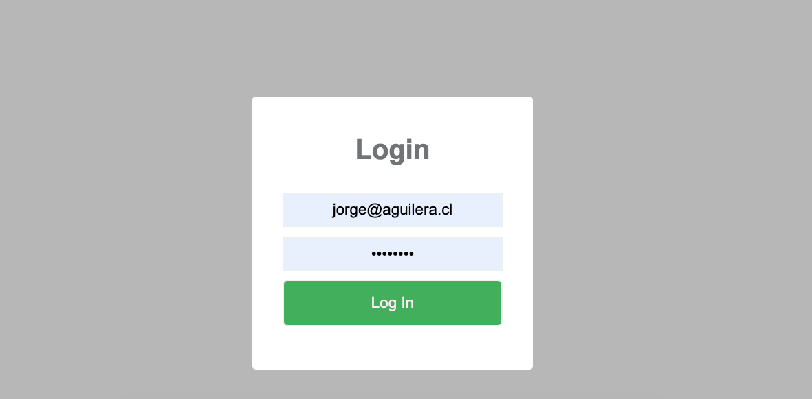
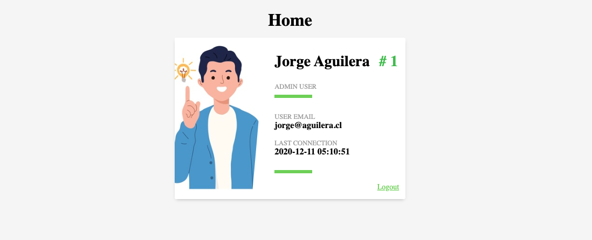
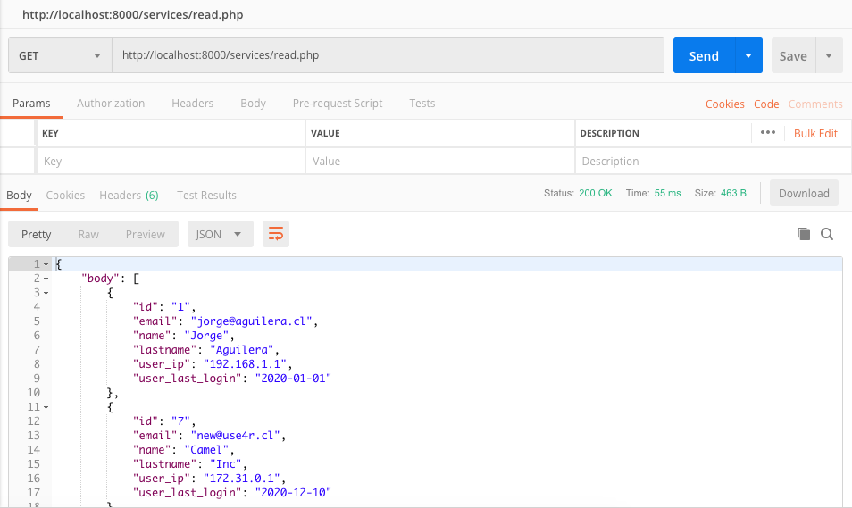
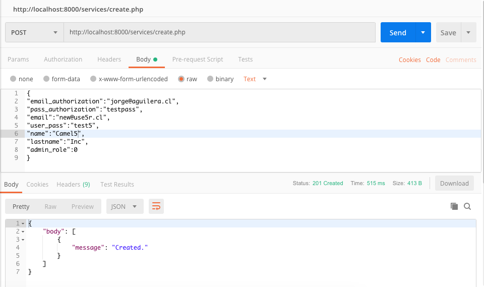
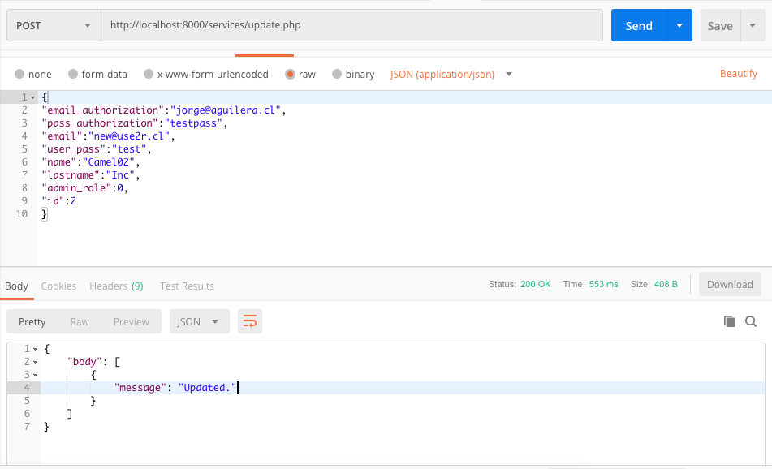
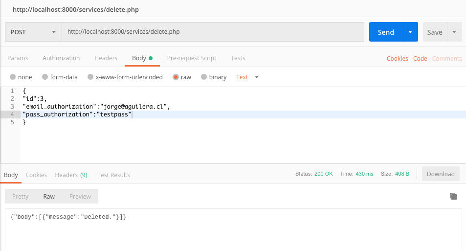

# Camel Challenge


This repository was created for Camel Challenge. 

You must use master branch.

## Installation

Clone the repository.

##Docker Initialization
*Execute the docker compose file (docker-compose.yml) using the following command.
(Required: [Docker](https://docker.com/)
)
```sh
docker-compose up
```
- Recomendation: The containers will use the following ports: 8000, 9000, 3306 (Close this ports if you are using it)

## Usage example

Docker containers are ready for use after run the previous command.

This repository have 3 containers:
1. [WebApp](http://localhost:9000/)
2. [ApiRest](http://localhost:8000/) (Postman)
3. [Mysql](http://localhost:3306/)

You can use WebApp for test webapp. WebApp use ApiRest as service.

## WEBAPP

When containers are up you can visit [WebApp](http://localhost:9000/).
The Default and only user is the admin user.

email: jorge@aguilera.cl

password: testpass

You can log in with this credentials and access to home. The home view  logs out automatically after 3 minutes of inactivity.




# API REST 

The API have the following services:
1. Read
2. Update
3. Create
4. Delete
5. Login

The test examples use POSTMAN.

##ADMIN CREDENTIALS

For services update, create, delete the service will require an admin email and password.

Default credentials:

email_authorization:jorge@aguilera.cl
pass_authorization:testpass

##READ

For use read you can consume the service from postman using this url:
http://localhost:8000/services/read.php

Parameters: Dont need parameters.



##Create

For use create you can consume the service from postman using this url:
http://localhost:8000/services/create.php

Parameters: Body example:

{
"email_authorization":"jorge@aguilera.cl",
"pass_authorization":"testpass",
"email":"new@use5r.cl",
"user_pass":"test5",
"name":"Camel5",
"lastname":"Inc",
"admin_role":0
}


##Update

For use update you can consume the service from postman using this url:
http://localhost:8000/services/update.php

Parameters: Body example:

{
"email_authorization":"jorge@aguilera.cl",
"pass_authorization":"testpass",
"email":"new@use2r.cl",
"user_pass":"test",
"name":"Camel02",
"lastname":"Inc",
"admin_role":0,
"id":2
}



##Delete

For use delete you can consume the service from postman using this url:
http://localhost:8000/services/delete.php

Parameters: Body example:

{
"id":3,
"email_authorization":"jorge@aguilera.cl",
"pass_authorization":"testpass"
}

* You can get the ids with read service, the delete service require only id atrribute and credentials for delete.




## Meta

Jorge Aguilera – aguileracontacto@gmail.com

